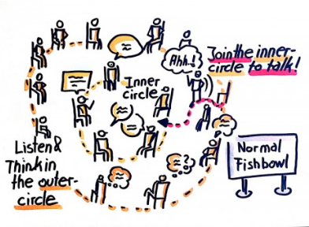

# rose-fse18
ROSE Festival, [FSE 2018](https://2018.fseconference.org/track/fse-2018-The-ROSE-Festival-Recognizing-and-Rewarding-Open-Science-in-Software-Engineering).  Recognizing and Rewarding Open Science in Software Engineering

- [Call for presentations](cfp.md) Due Sept 15.

_____

## Aim

 Create a venue where researchers can receive public credit for facilitating and participating in open science in SE (specifically, in creating replicated and reproduced results).

## Motivation

It can take months to years before a SE result is understood, repeated, extended (or perhaps even refuted). Yet SE research venues focus on new results rather than revisiting old ones.  This limits the kinds of work that appears at those venues. For example, consider the research maturity levels listed below. “Functional, reusable, available” can be assessed at the time of initial publication. However, “replicated, reproduced” may not become apparent until months or years after the initial publication.

## METHOD

We propose 90 minute conference sessions for FSE’18,Re’19, ESEC/FSE’19, ICSE’19, ESEC/FSE’19, RE'19  (and possibly as an ongoing even into the future) of the following form. 

- Part1a:   “Lightning talks” to report replicated or reproduced results (or negative results were replication and/or reproduction failed).
- Part1b: Invited talks on open science methods, successes (and failures)
- Part1c: a  fish-bowl panel  (defined later in this page) where participants discuss factors that help, or hurt, open science in SE. 
- Part2: After each ROSE session, a set of “ROSE notes on open science in SE” will be updated with notes on the open science practices in papers from the host conference and journals (e.g., TSE, TOSEM, EMSE).  These notes will include videos from Part1.
- Part3:  At regular intervals (say once every 2 years) we will run a journal special issue at a venue TBD on open science. This will be an open call to all authors (not just ROSE participants). Submissions will be invited on all aspects of open science including tips, traps, guidelines, case studies (some of which might come from ROSE presentations). Submissions should be full papers and original work.

Note that 
- Part1  could be run as part of a lunchtime session or, with a little wine, be a great way to have some fun at an evening mixer.  
- Part1  will be videoed and those video will be freely available.
- During Part1  we will run a chat stream so participants and audience can make extended comments.   
- ROSE is primarily a way to get larger parts of the community to see, and perhaps use, a more Open Science mindset  by showcasing studies that benefited from Open Science (and by  discussing/presenting methodological issues around Open Science, reproduction and replication).  As such, ROSE is more an “accelerator” or “festival” event than a standard technical track in a conference.

## RESULTS

1. A fun, lively and high energy session in a conference.
2. Ways to record a growing number of reproduced /replicated results.
3. A prominent message to SE researchers that “replicated/ reproduced” results are desired and prized in this community.

## CALL FOR PRESENTATIONS

- [Call for presentations](cfp.md) Due Sept 15. 

## BUT WHAT IS A "FISH-BOWL PANEL"?

 
 
 From [Wikipedia](http://en.wikipedia.org/wiki/Fishbowl_(conversation)):

- Four to five chairs are arranged in an inner circle. This is the fishbowl. 
- The remaining chairs are arranged in concentric circles outside the fishbowl.
- A few participants are selected to fill the fishbowl, while the rest of the group sits on the chairs outside the fishbowl. - In an open fishbowl, one chair is left empty. 
- The moderator introduces the topic and the participants start discussing the topic.
- The audience outside the fishbowl listens in on the discussion. 
= In an open fishbowl, any member of the audience can, at any time, occupy the empty chair and join the fishbowl. When this happens, an existing member of the fish-  bowl must voluntarily leave the fishbowl and free a chair. 
- The discussion continues with participants frequently entering and leaving the fishbowl.  

