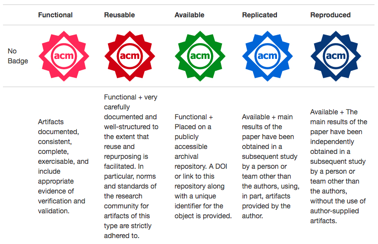

# Call for Presentations

##  The ROSE Festival, ESEC/FSE 2018 
##  Recognizing and Rewarding Open Science in Software Engineering  

Due Sept 15, 2018.  
Co-located with  [ESEC/FSE 2018](https://2018.fseconference.org/track/rosefest-2018). 

     

Review Committee:

- Chairs and organizers:
     - Robert Feldt, Chalmers Institute of Technology, Sweden
     - Tim Menzies, NC State University, USA
     - Thomas Zimmermann, Microsoft Research, USA
- Program Committee:
     - Leandro	Minkum University of Leicester, UK
     - Neil	Ernst, 	University of Victoria, Canda 
     - Daniel	Méndez, Technical University of Munich, Germany 
     - Sira	Vegas, Universidad Politécnica de Madrid, Spain
     - Chakkrit	Tantithamthavorn, University of Adelaide, Australia
     - Martin	Monperrus, University of Lille & INRIA, Sweden

 
## Aim

The ROSE festival is a world-wide salute to replication and reproducibility in SE (for a definition of these terms, see the end of this CFP).

Our aim is to create a venue where researchers can receive public credit for facilitating and participating in open science in SE (specifically, in creating replicated and reproduced results). ROSE is needed since most current conferences only evaluate research artifacts generated by that venue’s accepted papers. This makes it difficult for research papers to earn credit for replication and reproduction by other researchers (since no other team of researchers has yet to see this new result).

Enter ROSE. ROSE is a 90 minute session comprising lightning talks by researchers presenting replicated and reproduced results, followed by a panel discussing issues of replication in software engineering. Presentations can be about any prior SE publication (and is not restricted just to results from ESEC/FSE’18).

Note that:

- ROSE is a non-archival forum. Material presented at ROSE may also be submitted to other forums.
- Journal special issues are being planned to take the better ROSE-results to an archival publication. Venue TBD but, perhaps, the Empirical Software Engineering Journal.

## HOW TO SUBMIT:

Submit your proposal to [Easychair](https://easychair.org/conferences/?conf=rosefse18).

Submissions to ROSE are an abstract  (1page pdf, max) for a proposed lightning talk (2-5 mins). Each talk must be about two things:

- A prior SE publication (Paper1) which has been replicated/reproduced.
- Substantive evidence that that parts of Paper1 has been replicated/reproduced. This evidence must be substantive e.g.
     - A recent research SE paper (Paper2)
     - A Url links to an as yet unpublished pre-print

Note that Paper1 and Paper2 can come from any SE venue (ideally, peer-reviewed but if otherwise, reviewers will assess the paper on a case-by-case basis).

We also welcome methodological (meta) papers that help promote, facilitate or increase understanding about open science, replication and reproduction of software engineering research.

To facilitate easy reviewing, authors are encouraged to following the following format for their abstract:

- TITLE: “A [ Partial] (Replication|Reproduction) of XYZ”. Please add the term “partial” to your title if only some of the original work could be replicated/reproduced.
- WHO: name the original authors (and paper) and the authors that performed the replication/reproduction.
- WHAT: describe the “thing” being replicated/reproduced;
- WHY: clearly state why that “thing” is interesting/important;
- HOW: say how it was done first
- WHERE: describe the replication/reproduction. If the replication/reproduction was only partial, then explain what parts could be achieved or had to be missed.
- DISCUSSION: What aspects of this thing made it easier/harder to replicate/reproduce. What are the lessons learned from this work that would enable more replication/reproduction in the future for other kinds of tasks or other kinds of research.

Naturally, meta papers might need a different structure so if you are planning to do a meta talk please contact the chairs.

## EVALUATION:

- 2 PC members will review each abstract, possibly reaching out to the authors of the original Paper1.   Abstracts will be ranked as follows.
- If pc members do not find sufficient substantive evidence for replication/reproduction, the abstract will be rejected.  
- Any abstract that is overly critical of prior work, it will be rejected (*).
- The remaining abstracts will be sorted according to (a) interestingness and (b) correctness.  

The top 10 abstracts (or more, if there is time), will be invited to give lightning talks.

(*) Our goal is to foster a positive environment that supports and rewards researchers for conducting replications and reproductions.  To that end, we require that all ROSE abstracts and presentations pay due respect to the work they are reproducing/replicating. Criticisms of prior work is acceptable only as part of a balanced and substantive discussion of prior accomplishments.

## DEFINITIONS:

ROSE adopts the    ACM artifact badging conventions. ROSE seeks replicated and reproduced results defined as follows:

**IMPORTANT POINT:** Replication is more than just "they downloaded by scripts and ran exaxtly those". There must be something changed in the replication work (but perhaps that change is not very large).
