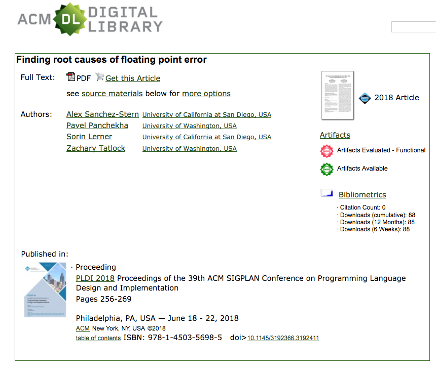
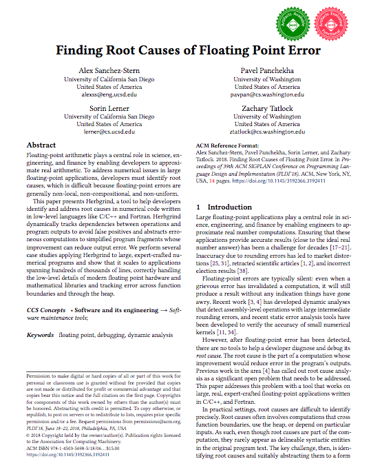
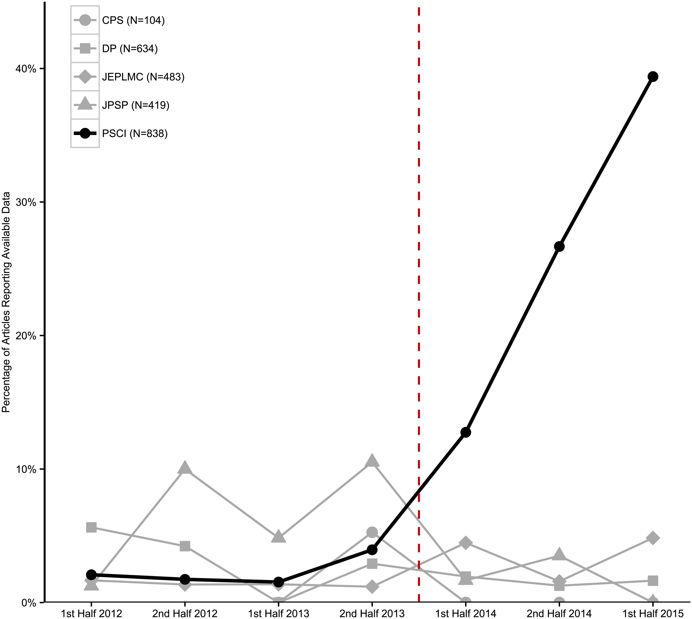

# Trends in Artifact Badging of SE Papers

(BTW, if you care about artifacts and badging, see the ROSE Festival, [FSE 2018](https://2018.fseconference.org/track/fse-2018-The-ROSE-Festival-Recognizing-and-Rewarding-Open-Science-in-Software-Engineering):  recognizing and Rewarding Open Science in Software Engineering)

Many 
branches of software engineering  are organizing themselves 
around replication packages. 
For example, here is the ACM categorization of
such packages:

**IMPORTANT POINT:** Replication is more than just "they downloaded by scripts and ran exaxtly those". There must be something changed in the replication work (but perhaps that change is not very large).

These badges are now appearing in, e.g. ACM portal tagged to the papers
(and note that similar badging schmes are currently being implemented for Elseiver and IEEE paper
repositories):

Such papers receive a colorful badge to add to page one of their text:

This simple technique has a signifnca impact on the rate
at which authors offer reusable artifacts from their papers:

- Notes from [Badges to Acknowledge Open Practices: A Simple, Low-Cost, Effective Method for Increasing Transparency](https://journals.plos.org/plosbiology/article?id=10.1371/journal.pbio.1002456)
- "Beginning January 2014, Psychological Science gave authors the opportunity to signal open data and materials if they qualified for badges that accompanied published articles. Before badges, less than 3% of Psychological Science articles reported open data. After badges, 23% reported open data, with an accelerating trend; 39% reported open data in the first half of 2015, an increase of more than an order of magnitude from baseline. There was no change over time in the low rates of data sharing among comparison journals. Moreover, reporting openness does not guarantee openness. When badges were earned, reportedly available data were more likely to be actually available, correct, usable, and complete than when badges were not earned. Open materials also increased to a weaker degree, and there was more variability among comparison journals. Badges are simple, effective signals to promote open practices and improve preservation of data and materials by using independent repositories."

